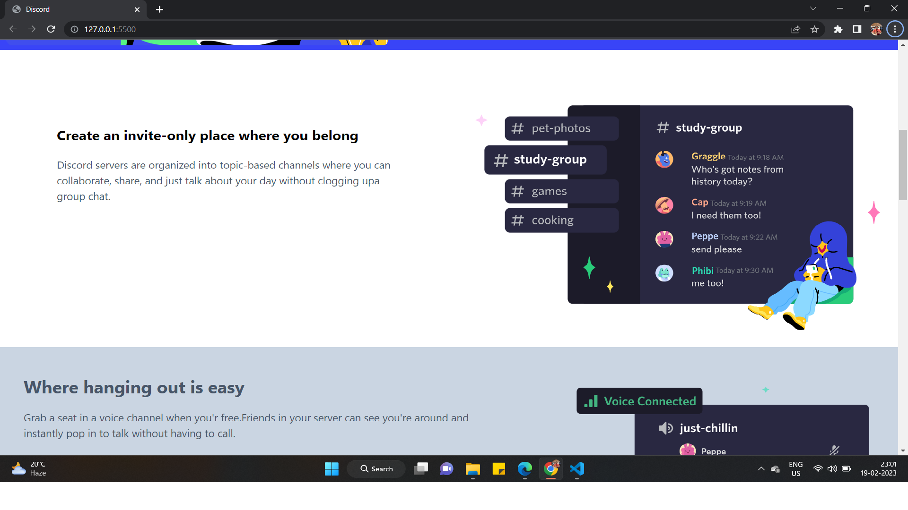
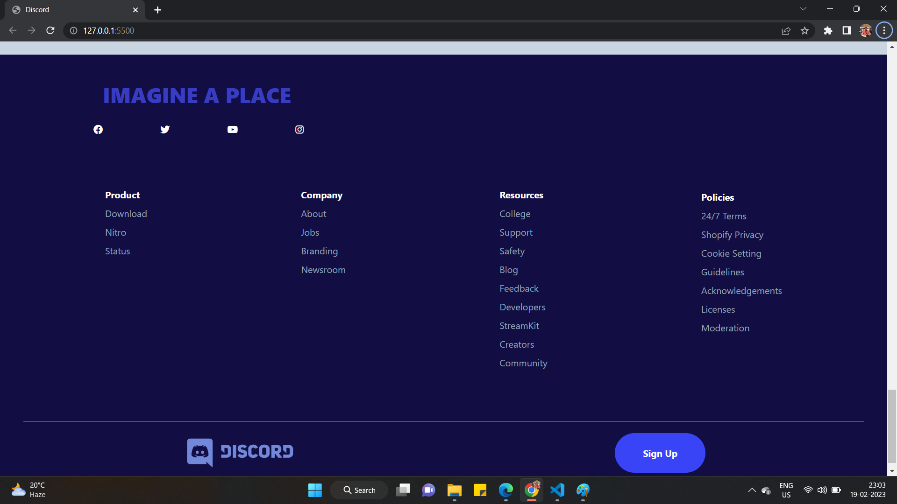
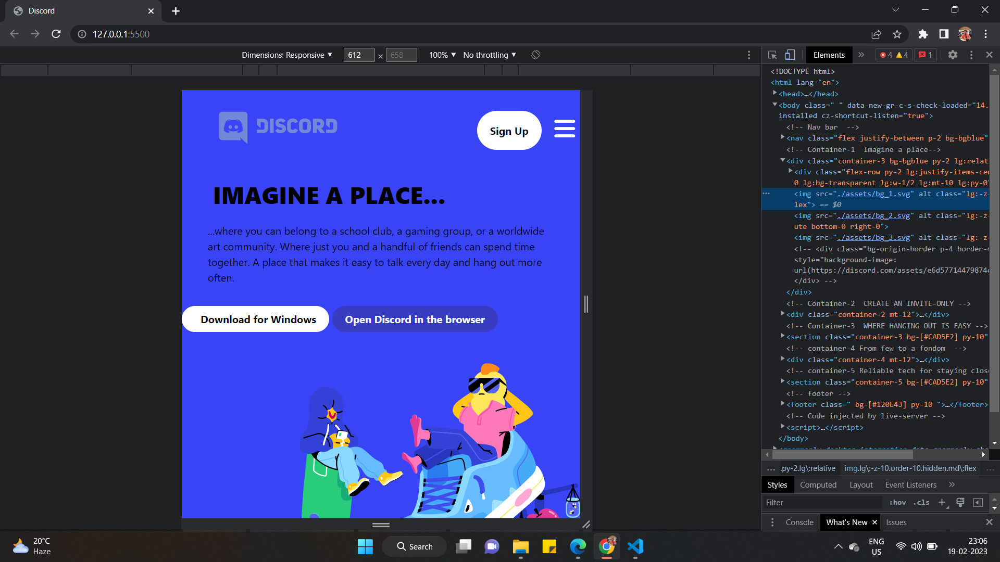
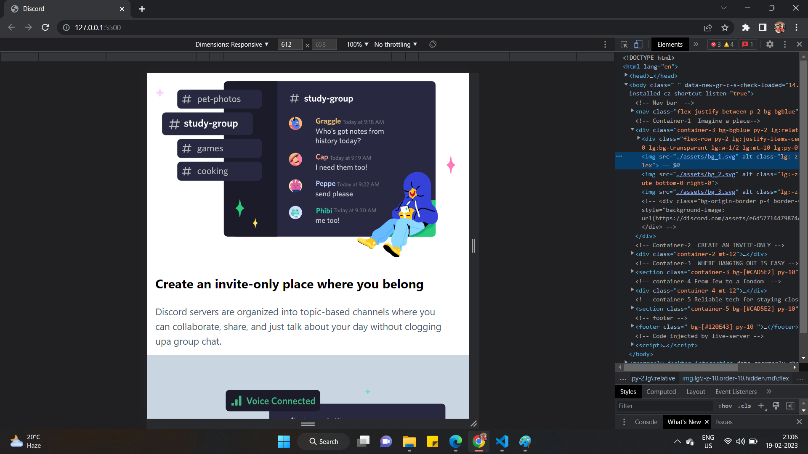
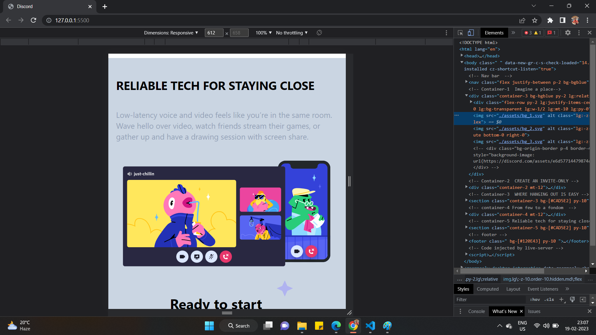
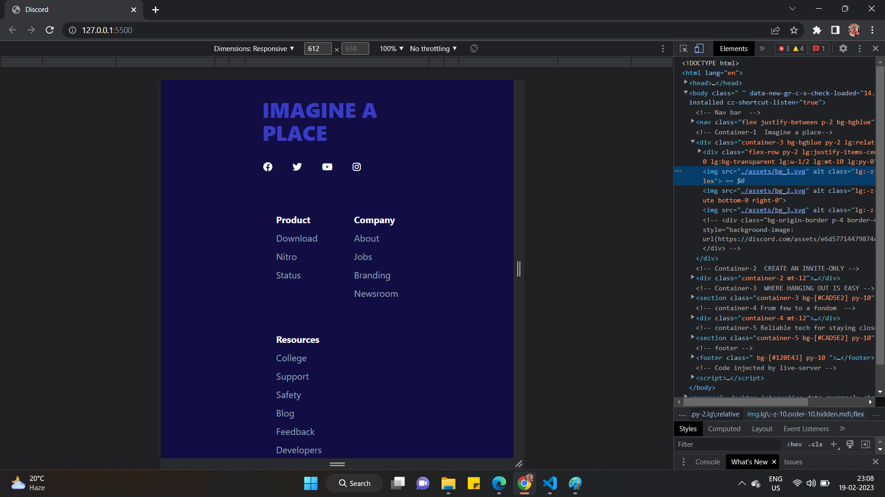
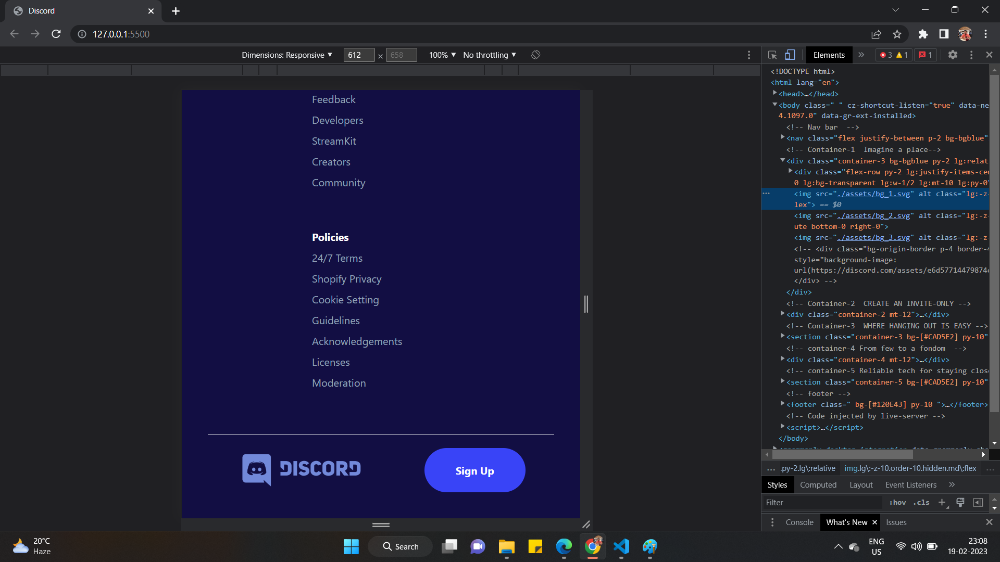

# DISCORD Homepage Design Clone

I have cloned the [DISCORD](https://discord.com/) homepage website using HTML and TAILWIND CSS only.


## Tech Stack:

### `HTML`
### `TAILWIND CSS`

***
### Check the live website [here](https://discordhomepageclone.netlify.app/ "RODE")

## My Learnings 
- Learned more classes in Tailwind.
- Created responsive page.
- Learned flexbox concept in Tailwind .
- Used flexbox to make website responsive
- Learned how to place elements on top of images in tailwind.
- Learned ```z-index``` properties

### How the website looks:
***





### Responsive 






***

## [Linkedin-Manish](www.linkedin.com/in/manish-kumar-b0639a170)
## [FindCoder-Manish](https://www.findcoder.io/u/itmanishsingh)
## [GitHub](https://github.com/itsmanishsingh)

